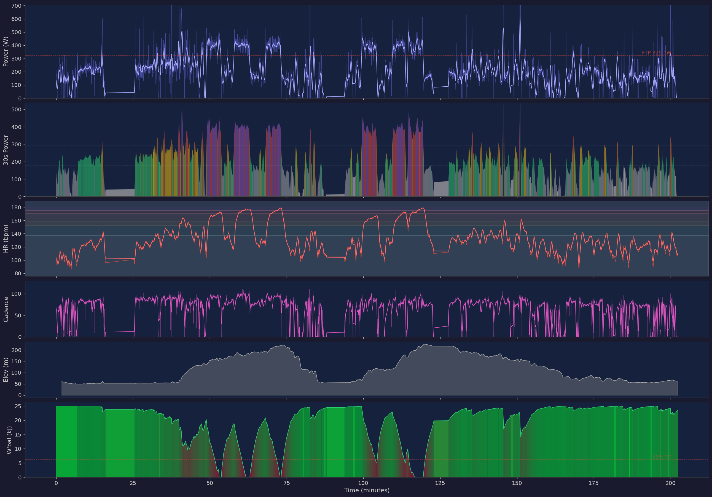

# Claudius the Cycling Coach

A set of [Claude Code](https://claude.ai/claude-code) skills that turn Claude into a cycling coach and training logger, powered by [Intervals.icu](https://intervals.icu) training data.

Claudius reads your workout data, generates charts, classifies your sessions, gives coaching feedback, and logs your weight training — all from the command line.

## What It Does

Six slash commands, each a different coaching interaction:

| Command | What it does |
|---------|-------------|
| `/review` | Analyze a specific workout — generates a 6-panel chart, classifies the session type (intervals, endurance, race, etc.), and assesses execution quality |
| `/weekly-review` | Review recent training load, intensity distribution, and progression over the last 30 days |
| `/status` | Quick check: current fitness (CTL/ATL/TSB), recovery readiness, and what to do today |
| `/plan` | Prescribe the next 3-5 days of workouts based on current fitness and fatigue |
| `/science` | Look up training science topics with evidence-based explanations |
| `/log-weights` | Describe your gym sessions conversationally and save them as completed activities in Intervals.icu |

### Workout Review Example

```
> /review last Wednesday's ride

## Workout Review — Cycling (2026-03-25)
Classification: 6x5min threshold/VO2max intervals on climbs with ride-out/ride-home

W'bal structure: 6 depletion cycles detected, each reaching 0-2% W',
spaced ~8min apart. Classic interval pattern.
...
```

The `/review` skill generates a 6-panel workout chart showing power, zone distribution, heart rate, cadence, elevation, and W' balance:



### Weight Training Logging Example

```
> /log-weights Monday I did squats 3x10 at 60lb each side, leg press
  180lb each side. Wednesday was upper body — pull-ups 12, 8, 7 reps,
  lat pulldown 3x10 at 170lb, seated row 3x10 at 190lb.

### Mon Mar 30 — Heavy Leg Day

| Exercise          | Sets × Reps | Weight              | Notes         |
|-------------------|-------------|---------------------|---------------|
| Barbell Squats    | 3×10        | 60 lb/side (~165 lb)| Executed well |
| Leg Press         | 3×10        | ~180 lb/side        |               |

### Wed Apr 1 — Upper Body

| Exercise          | Sets × Reps | Weight    | Notes      |
|-------------------|-------------|-----------|------------|
| Pull-ups          | 12, 8, 7    | Bodyweight|            |
| Lat Pulldown      | 3×10        | 170 lb    |            |
| Seated Cable Row  | 3×10        | 190 lb    |            |

Does this look right? I'll save these to Intervals.icu.

> yes

Saved 2 weight training activities to Intervals.icu:
- Mon Mar 30: Heavy Leg Day (id: i137051310)
- Wed Apr 1: Upper Body (id: i137051324)
```

## How It Works

```
Intervals.icu API  -->  MCP Server  -->  Claude Code  -->  Coaching Skills
    (your data)        (48 tools)       (CLAUDE.md)      (/review, etc.)
```

- **[intervals-icu-mcp](https://github.com/richardkiss/intervals-icu-mcp)** provides 48 MCP tools covering activities, streams, wellness, performance curves, calendar, and sport settings
- **CLAUDE.md** defines the coaching persona, athlete reference data (FTP, zones, HR zones), and training science frameworks
- **Slash command skills** (`.claude/commands/`) are structured prompts that orchestrate the MCP tools into coaching workflows
- **chart.py** generates workout visualizations from stream data (power, HR, cadence, elevation, W'bal)

## Setup

### Prerequisites

- [Claude Code](https://claude.ai/claude-code) CLI installed
- [uv](https://docs.astral.sh/uv/) for Python package management
- An [Intervals.icu](https://intervals.icu) account with API access

### 1. Clone and install the MCP server

```bash
git clone https://github.com/richardkiss/intervals-icu-mcp.git
cd intervals-icu-mcp
uv sync
```

### 2. Configure your MCP connection

Copy the example config and fill in your credentials:

```bash
cp .mcp.json.example .mcp.json
```

Edit `.mcp.json` with your Intervals.icu API key and athlete ID. You can find these in your [Intervals.icu settings](https://intervals.icu/settings).

### 3. Customize CLAUDE.md

Update the **Athlete Reference** section in `CLAUDE.md` with your own thresholds:

```markdown
- **FTP:** 325W | **W':** 25kJ | **LTHR:** 171 bpm | **Max HR:** 189 bpm
```

Replace with your values. The power zones and HR zones will need updating too.

### 4. Install chart dependencies

```bash
pip install matplotlib numpy
```

### 5. Run

```bash
claude
> /review yesterday's ride
> /status
> /plan
```

## Project Structure

```
.
├── CLAUDE.md                    # Coaching persona, athlete data, training science
├── .claude/
│   └── commands/                # Slash command skills
│       ├── review.md            # Workout review
│       ├── weekly-review.md     # Training block review
│       ├── status.md            # Daily fitness check
│       ├── plan.md              # Workout prescription
│       ├── science.md           # Training science lookup
│       └── log-weights.md       # Weight training logger
├── scripts/
│   └── chart.py                 # 6-panel workout chart generator
├── memory/                      # Project context and learnings
└── .mcp.json.example            # MCP server config template
```

## The Weight Training Logger

The `/log-weights` skill lets you describe gym sessions in plain language. It:

1. Parses your conversational description into structured exercises (names, sets, reps, weights)
2. Shows you a table to confirm before saving
3. Creates manual activities in Intervals.icu via the API — these show as completed workouts on your calendar, just like device-recorded rides
4. Flags any injuries or pain prominently

It handles natural language like "the thing where I pull down a bar" (lat pulldown), calculates total barbell weight from per-side descriptions ("60 lb each side" → ~165 lb total), and marks unknown weights as "not recorded" rather than guessing.

## The Workout Review Skill

The `/review` skill is the most developed. It:

1. Fetches activity streams from Intervals.icu
2. Computes W'bal depletion cycles to classify the workout structure
3. Generates a 6-panel chart (power, zones, HR, cadence, elevation, W'bal)
4. Classifies the session type from the depletion pattern
5. Fetches supporting metrics (best efforts, TSS, IF)
6. Presents a coaching review with assessment and recommendations

The classification uses W'bal depletion cycle counting as its primary signal:

| Depletion cycles | Classification |
|---|---|
| 0 | Endurance or recovery ride |
| 1 | TT or sustained threshold effort |
| 4-8 with similar spacing | Structured interval session |
| 9+ irregular | Race or group ride |

## License

MIT
